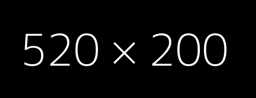

---
{
	"title": "Introduction block with image",
	"language": "fr",
	"altLangPage": "gc-intro-image-fr.html",
	"breadcrumbs": [
		{ "title": "GCWeb home", "link": "https://wet-boew.github.io/GCWeb/index-en.html" }
	],
	"dateModified": "2024-06-11"
}
---

	

		

			

				<h1 property="name" id="wb-cont">Introduction block with full-width imageBloc d'introduction avec image pleine largeur</h1>
				
The introduction block pattern introduces the content of a landing page.La configuration de conception du bloc d'introduction introduit le contenu d'une page de destination.

				
<a class="btn btn-call-to-action" href="#">Supertask buttonBouton de super-tâche</a>

			

		

	

	<h2>Code sample</h2>
	

	

		

			

				<h1 property="name" id="wb-cont">Introduction block with full-width imageBloc d'introduction avec image pleine largeur</h1>
				
The introduction block pattern introduces the content of a landing page.La configuration de conception du bloc d'introduction introduit le contenu d'une page de destination.

				
<a class="btn btn-call-to-action" href="#">Supertask buttonBouton de super-tâche</a>

			

		

	



	

		

			

				<h1 property="name" id="wb-cont">Introduction block with half-width imageBloc d'introduction avec image demi largeur</h1>
				
The introduction block pattern introduces the content of a landing page.La configuration de conception du bloc d'introduction introduit le contenu d'une page de destination.

				
<a class="btn btn-call-to-action" href="#">Supertask buttonBouton de super-tâche</a>

			

			

					
			

		

	

	<h2>Code sample</h2>
	

	

		

			

				<h1 property="name" id="wb-cont">Introduction block with half-width imageBloc d'introduction avec image demi largeur</h1>
				
The introduction block pattern introduces the content of a landing page.La configuration de conception du bloc d'introduction introduit le contenu d'une page de destination.

				
<a class="btn btn-call-to-action" href="#">Supertask buttonBouton de super-tâche</a>

			

			

					
			

		

	



